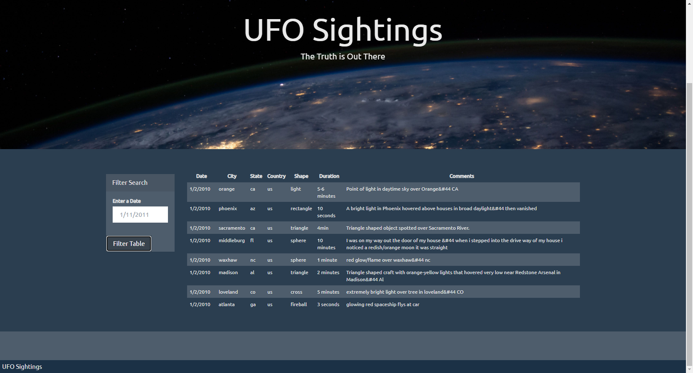

# JavaScript-challenge - JavaScript and DOM Manipulation

# ALIENS-R-REAL ?

## Background

WAKE UP SHEEPLE! The extra-terrestrial menace has come to Earth and we here at `ALIENS-R-REAL` have collected all of the eye-witness reports we could to prove it! All we need to do now is put this information online for the world to see and then the matter will finally be put to rest.

There is just one tiny problem though... our collection is too large to search through manually. Even our most dedicated followers are complaining that they are having trouble locating specific reports in this mess.

To solve this problem,a dynamic javascript and DOM manipulation was created to allow the users to filter the table data for specific values. JavaScript, HTML, CSS, and D3.js have been used to deploy the data on the web page.

### Level 1: Automatic Table and Date Search 

* A basic HTML web page was created.
* All the UFO dataset JavaScript objects were appended to a table in to the web page, and then a new rows added for each UFO sighting.
* Finally date/time, city, state, country, shape, and comment columns was created.
* On this part we displayed a form with a filtering option that uses the date/time column to find rows that match user input.

To view the [JavaScript Code](UFO-level-1/static/js/app.js)
To view the [HTML code](UFO-level-1/index.html)
To view [Data](UFO-level-1/static/js/data.js)

### Level 2: Multiple Search Categories

* Level two satisfies all the criterias of Level 1, but it added a multiple input tags and/or select dropdowns, so that the users can set a multiple filters and search for UFO sightings using the following criteria based on the table columns:
  1. `date/time`
  2. `city`
  3. `state`
  4. `country`
  5. `shape`

  

To view the [JavaScript Code](UFO-level-2/static/js/app.js)
To view the [HTML code](UFO-level-2/index.html)
To view [Data](UFO-level-2/static/js/data.js)

### Copyright

Trilogy Education Services © 2019. All Rights Reserved.